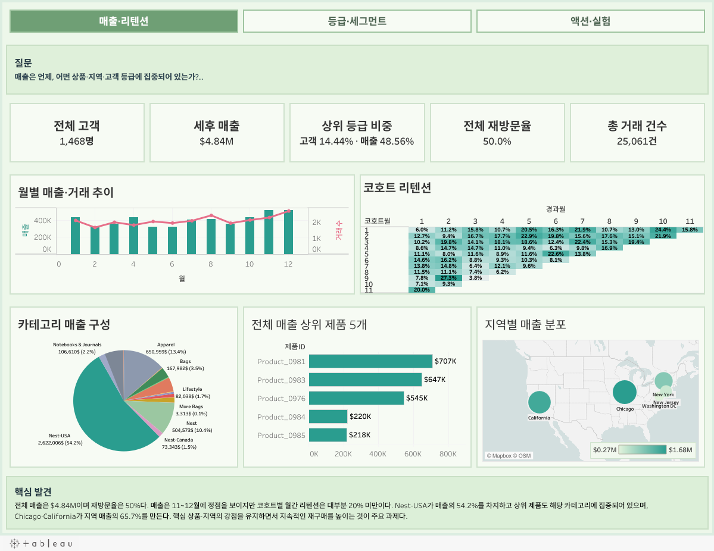

# Dacon 이커머스 고객 분석

2019년 온라인 커머스 거래로 매출 구조, 관측기간 코호트, RFM 고객 등급과 등급별
실험 후보를 분석한 포트폴리오 프로젝트다.

> 공개 데이터를 실무처럼 다루기 위해 만든 가상 CRM 시나리오이며 실제 회사 요청이나
> 캠페인 결과가 아니다.

## 핵심 결과

- 원본 상품라인 **52,924행**, 고객 **1,468명**, 거래 **25,061건**을 분석했다.
- 상품 매출은 **`$4.84M`**이다. 할인 후·GST 포함·배송비 제외 기준이다.
- 원본에 반복된 배송비는 거래당 한 번만 반영했으며 총 **`$220.5K`**다.
- Diamond·Platinum은 고객의 14.4%이며 상품 매출의 약 48.6%를 차지한다.
- 2019년 관측기간 첫 구매 후 월별 복귀율은 낮다. 다만 실제 생애 첫 구매나 신규
  획득 코호트가 아니므로 신규 온보딩 성과로 해석하지 않는다.
- Silver·Gold·Platinum에는 누적 상품 매출이 높지만 최근 구매가 줄어든 고객이 있다.

등급별 매출과 재방문 차이는 R/F/M으로 등급을 만든 결과의 영향을 포함한다. 따라서
이를 독립적인 등급 효과가 아니라 고객 프로파일로 해석하고, 실제 운영 전에는 과거
기간 등급이 미래 매출·복귀를 예측하는지 검증해야 한다.

## Tableau 대시보드

[Tableau Public에서 보기](https://public.tableau.com/app/profile/.16528220/viz/_17872369187540/01)

[](https://public.tableau.com/app/profile/.16528220/viz/_17872369187540/01)

- **매출·리텐션**: 핵심 KPI, 월별 매출·거래, 코호트, 카테고리·제품·지역 집중도를 본다.
- **등급·세그먼트**: RFM 등급별 가치와 행동 세그먼트의 우선순위를 비교한다.
- **액션·실험**: 관찰 결과를 확정 정책이 아닌 고객군별 실험 후보와 측정 지표로 연결한다.

## 데이터 정의

| 항목 | 정의 |
|---|---|
| 분석 기간 | 2019-01-01~2019-12-31 |
| 상품 매출·Monetary | 할인 후·GST 포함·배송비 제외 `세후금액` |
| 고객 결제액 | 상품 매출 + 거래당 배송비 1회 |
| 거래수 | `COUNT(DISTINCT 거래ID)` |
| 재방문 | 서로 다른 구매일이 2일 이상 |
| 관측기간 첫 구매 | 2019년 데이터에서 가장 이른 구매일·월 |
| 장기 미방문 | 60/90/120/150일 시나리오 비교, 기본 예시는 90일 |
| 통화 | `$` |

상세 기준은 [분석 지표 계약](docs/metric_contract.md)을 따른다.

## RFM 등급 프로파일

| 등급 | 고객수 | 고객 비중 | 1인당 상품 매출 | 연간 재방문율 |
|---|---:|---:|---:|---:|
| Diamond | 58 | 4.0% | `$17,482` | 94.8% |
| Platinum | 154 | 10.5% | `$8,677` | 88.3% |
| Gold | 243 | 16.6% | `$4,848` | 74.1% |
| Silver | 315 | 21.5% | `$2,484` | 56.8% |
| Bronze | 698 | 47.5% | `$758` | 26.4% |

PCA PC1 로딩은 고객 간 분산을 요약하는 가중치다. 비즈니스 중요도나 예측 중요도를
뜻하지 않는다. 자세한 내용은 [RFM 방법론](docs/methodology.md)에 정리했다.

## 분석 노트북

| 순서 | 노트북 | 역할 |
|---:|---|---|
| 00 | [ETL](notebooks/00_etl_pipeline.ipynb) | 원본 보존, 조인·배송비·행 수 검증 |
| 01 | [EDA](notebooks/01_eda.ipynb) | 매출·고객·상품라인·마케팅 기술통계 |
| 02 | [Retention](notebooks/02_retention.ipynb) | 관측기간 코호트와 카테고리 복귀 |
| 03 | [RFM](notebooks/03_rfm_segmentation.ipynb) | 점수·등급·세그먼트 프로파일 |
| 04 | [Bronze](notebooks/04_segment_bronze.ipynb) | 저활성·장기 미방문 프로파일 |
| 05 | [Silver](notebooks/05_segment_silver.ipynb) | 성장 가능군·장기 미방문 프로파일 |
| 06 | [Gold](notebooks/06_segment_gold.ipynb) | 상위 등급 인접군·장기 공백 분석 |
| 07 | [Diamond/Platinum](notebooks/07_segment_diamond_platinum.ipynb) | 구매 간격·쿠폰·진입 카테고리 연관성 |
| 08 | [프로젝트 요약](notebooks/08_project_summary.ipynb) | 최종 결과·한계·실험 우선순위 |

## 실험 우선순위

현재 데이터에서 액션의 효과나 최적 타이밍은 확정하지 않는다. 다음을 실험 후보로 둔다.

| 우선순위 | 대상 | 비교할 실험 | 핵심 지표 |
|---|---|---|---|
| 1 | 관측 초기·Bronze | 30일 vs 60일 재참여 | 후속 30일 다른 날 재구매율 |
| 2 | Silver/Gold 장기 미방문 | 60/90/120일 접촉 | 복귀·마진·수신거부율 |
| 3 | Platinum 장기 미방문 | 개인화 vs 일반 메시지 | 복귀·할인비용률 |
| 4 | D/P 적격 고객 | 등급 혜택 vs 쿠폰 | 증분 재구매·AOV |

실험 전 고객 단위 무작위 배정, MDE·필요 표본 수, 중복 노출 방지와 가드레일을 확정한다.

## 구조

```text
├── data/                 # 원본 CSV, 저장소 제외
├── docs/                 # 지표 계약·RFM·SQL 역할 문서
├── notebooks/            # 00~08 분석 및 저장 출력
├── sql/                  # 이름 단위 분석 SQL
└── tableau/              # Tableau 데이터 정의·최종 액션 카드
```

## 한계

- 1개년 합성 데이터라 반복 계절성을 검증할 수 없다.
- 캠페인 ID, 고객별 광고 노출, 비용·마진이 없어 ROI와 캠페인 효과를 추정할 수 없다.
- RFM 구간과 PCA 가중치는 현재 데이터에서 다시 추정된다. 운영 시 버전 고정과
  드리프트 모니터링이 필요하다.
- 90일 장기 미방문은 운영 시나리오이며 민감도와 비용을 함께 검토해야 한다.
